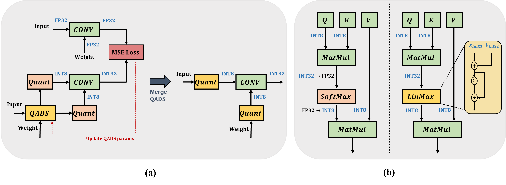

# HyQ: Hardware-Friendly Post-Training-Quantization for CNN-Transformer Hybrid Networks
HyQ is a set of techniques designed for quantizing CNN-transformer hybrid models in a hardware-friendly way. This repository contains the official source code used to run experiments for the paper.

## Abstract
Hybrid models that combine convolutional neural networks (CNNs) and vision transformers (ViTs) have recently emerged as state-of-the-art computer vision models. To efficiently deploy these hybrid models involving significant amounts of parameters on resource-constrained mobile/edge devices, quantization is emerging as a promising solution. However, post-training quantization (PTQ), which does not require retraining or labeled data, has not been extensively studied for hybrid models. 
%Furthermore, owing to the complex structure of the hybrid model that combines both convolutions and transformer blocks, quantizing hybrid models using existing methods results in significant accuracy drops. 
In this study, we propose a novel PTQ technique specialized for CNN-transformer hybrid models by considering the hardware design of hybrid models on AI accelerators such as GPUs and FPGAs. First, we introduce quantization-aware distribution scaling (QADS) to address the large outliers caused by inter-channel variance in convolution layers. Furthermore, in the transformer block, we propose approximating the integer-only softmax with a linear function. This approach allows us to avoid costly FP32/INT32 multiplications, resulting in more efficient computations. We demonstrate the superiority of our proposed method on the ImageNet-1k dataset using various hybrid models. In particular, the proposed quantization method with INT8 precision demonstrated a 0.39\% accuracy drop compared with the FP32 baseline on MobileViT-s. Furthermore, when implemented on the FPGA platform, the proposed linear softmax achieved significant resource savings, reducing the look-up table (LUT) and flip-flop (FF) usage by $1.8 \sim 2.1\times$ and $1.3 \sim 1.9\times$, respectively, compared with the existing second-order polynomial approximation.

## Getting Started

### Install

- Create a conda virtual environment and activate it.

```bash
conda create -n HyQ python=3.10 -y
conda activate HyQ
```

- Install PyTorch and torchvision. e.g.,

```bash
conda install pytorch==1.12.1 torchvision==0.13.1 cudatoolkit=11.3 -c pytorch 
or
pip install torch==1.12.1+cu113 torchvision==0.13.1+cu113 --extra-index-url https://download.pytorch.org/whl/cu113

pip install timm==0.9.5
```

### Data preparation

You should download the standard ImageNet Dataset.

```
├── imagenet
│   ├── train
│
│   ├── val
```

### Running the Experiment
To run the experiment, use the following command:

```
cd HyQ
python test_quant.py mobilevit_xxs <dataset folder> --quant --QADS --ptf --lis
```
Replace <dataset folder> with the path to your dataset.

- `mobilevit_xxs`: model architecture, which can be replaced by `mobilevit_xxs`, `mobilevit_xs`, and `mobilevit_s`.

- `--quant`: whether to quantize the model.

- `--QADS`: whether to use **Quantization-Aware Distribution Scaling**

- `--ptf`: whether to use Power-of-Two Factor Integer Layernorm.

- `--lis`: whether to use Log-Integer-Softmax.

- `--quant-method`: quantization methods of activations, which can be chosen from `minmax`, `ema`, `percentile` and `omse`.

---


### Figure 2: Overview of the proposed HyQ. (a) The QADS optimization process. First, a calibration set is used to determine the QADS parameters that minimize the difference between the FP32 and INT32 outputs. The obtained QADS parameters are then merged into the existing quantizer module. (b) Attention operation using conventional quantization (Left) vs. attention operation using the proposed linear softmax (Right).



### Table 1: Comparison of top-1 accuracy with other quantization methods on the ImageNet-1k dataset

| Model | Method | Prec. (W/A) | Size (MB) | Top-1 Acc. (%) | Acc. Drop (%) |   
|-------|--------|-------------|-----------|------|-----| 
| MobileViT-xxs | Baseline | 32/32 | 1.27M | 68.94 | - |    
|               | FQ-ViT     | 8/8 | 0.32M | 66.46 | 2.48 |
|               | Percentile | 8/8 | 0.32M | 67.54 | 1.40 |
|               | OMSE       | 8/8 | 0.32M | 66.69 | 2.25 |                   
|               | Q-HyViT    | 8/8 | 0.32M | 67.20 | 1.74 | 
|               | Ours       | 8/8 | 0.32M | 68.15 | 0.79 | 
| MobileViT-xs  | Baseline | 32/32 | 2.32M | 74.63 | - |    
|               | FQ-ViT     | 8/8 | 0.58M | 68.28 | 6.35 |
|               | Percentile | 8/8 | 0.58M | 62.96 | 11.67 |
|               | OMSE       | 8/8 | 0.58M | 68.41 | 6.22 |
|               | Q-HyViT    | 8/8 | 0.58M | 73.89 | 0.75 |
|               | Ours       | 8/8 | 0.58M | 73.99 | 0.64 | 
| MobileViT-s   | Baseline | 32/32 | 5.58M | 78.32 | - |    
|               | FQ-ViT     | 8/8 | 1.40M | 77.67 | 0.65 |
|               | Percentile | 8/8 | 1.40M | 77.85 | 0.47 |
|               | OMSE       | 8/8 | 1.40M | 77.61 | 0.71 |
|               | Q-HyViT    | 8/8 | 1.40M | 77.72 | 0.59 | 
|               | Ours       | 8/8 | 1.40M | 77.93 | 0.39 | 

## Table 2: Performance comparison of HyQ using state-of-the-art hybrid models (i.e., EfficientFormer and MobileViTv2) on ImageNet-1k dataset

| Model | Method | Prec. (W/A) | Top-1 Acc. (%) | Acc. Drop (%) |
|-------|--------|-------------|-----------------|---------------|
| EfficientFormer-L1 | Baseline | 32/32 | 80.50 | - |
| | FQ-ViT | 8/8 | 66.63  | 13.87 |
| | Percentile | 8/8 | 77.15  | 3.35 |
| | OMSE | 8/8 | 76.90 | 3.6 |
| | Ours | 8/8 | 78.55 | 1.95 |
| EfficientFormer-L3 | Baseline | 32/32 | 82.55 | - |
| | FQ-ViT | 8/8 | 81.85  |  0.7  |
| | Percentile | 8/8 | 80.37 | 2.18 |
| | OMSE | 8/8 | 81.69 | 0.86  |
| | Ours | 8/8 | 82.26 | 0.29  |
| EfficientFormer-L7 | Baseline  | 32/32 | 83.38 | -         |
| | FQ-ViT    | 8/8   | 82.47 |  0.91     |
| | Percentile | 8/8   | 50.94 | 32.44     |
| | OMSE      | 8/8   |  3.23 | 80.15     |
| | Ours      | 8/8   | 82.66 |  0.72     |
| MobileViTv2-50 | Baseline  | 32/32 | 70.16 | -         |
| | Q-HyViT   | 8/8   | 68.73 | 1.43      |
| | Ours      | 8/8   | 69.16 | 1.00      |
| MobileViTv2-75 | Baseline | 32/32 | 75.61 | -         |
| | Q-HyViT   | 8/8   | 74.36 | 1.25      |
| | Ours      | 8/8   | 74.47 | 1.14      |


## Contributing

Our code is based on [FQ-ViT](https://github.com/megvii-research/FQ-ViT). We sincerely thank the contributors of FQ-ViT for their outstanding work.
